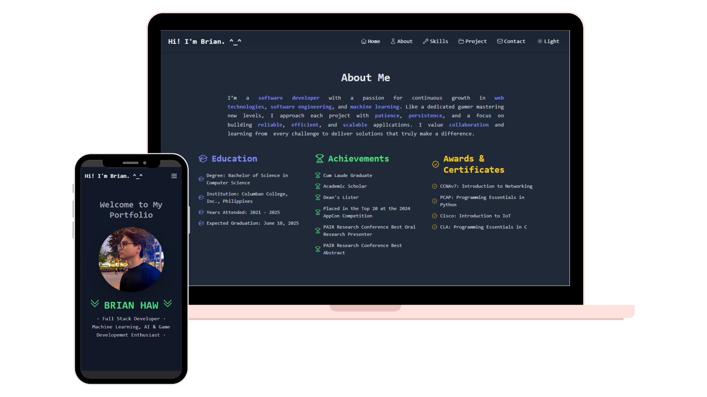

<h2 align="center">
  Brian O. Haw Portfolio - v1.0<br/>
  <a href="https://brianshiroe.netlify.app" target="_blank">brianshiroe.netlify.app</a>
</h2>

---



## Description

Feel free to clone this repo and customize it as your own portfolio. Please give credit by linking back to [github.com/BrianShiroe](https://github.com/BrianShiroe). Thank you!

## Built With

My personal portfolio site built with modern web technologies to showcase my skills and tells a little bit about my story.

- React  
- TypeScript  
- Tailwind CSS  
- Vite (or Create React App)  

## Features

**🎨 Clean, Responsive Design with Tailwind CSS**  

**⚛️ Built with React & TypeScript for scalable architecture**  

**🌙 Dark and Light mode supported**  

**📱 Fully Responsive across all device sizes**  

## Getting Started

To get a local copy up and running follow these simple steps.

### Prerequisites

- Node.js. Link: https://nodejs.org/en
- Git. https://git-scm.com/downloads

## 🛠 Installation and Setup Instructions

1. Clone repository
```bash
git clone https://github.com/BrianShiroe/portfolio-react-typescript-tailwind.git
```
2. Navigate to the project directory
```bash
cd portfolio-react-typescript-tailwind
```
3. Install dependencies:
```bash
npm install
```
4. Install tailwind and its dependencies
```bash
npm install -D tailwindcss@3 postcss autoprefixer
```
5. Initialize tailwind CSS config
```bash
npx tailwindcss init -p
```
6. Run the project
```bash
npm start
```

Runs the app in the development mode.\
Open [http://localhost:3000](http://localhost:3000) to view it in the browser.
The page will reload if you make edits.

### Show your support

Give a ⭐ if you like this website!
